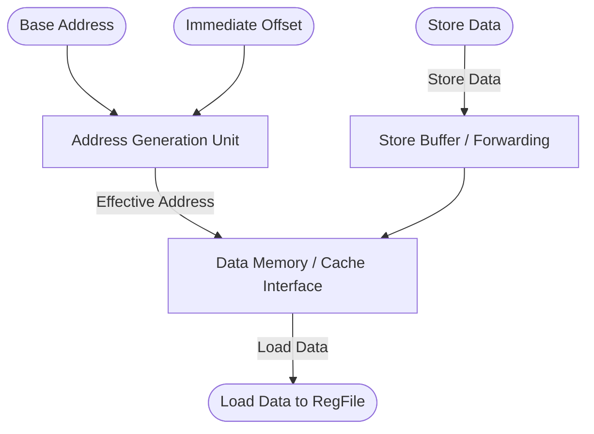

# Load-Store Unit (LSU)

## 1. Overview
The Load-Store Unit (LSU) handles all memory access instructions (`LW`, `SW`, `LD`, `SD`, Atomics, etc.). It calculates the effective memory address and interfaces directly with the L1 Data Cache (or `DataMem` in simulation).

## 2. Detailed Diagram

## 3. Configuration & Sizes
- **Address Space**: 64-bit virtual/physical addresses.
- **Data Path**: 64-bit.
- **Supported Ops**: Byte, Half, Word, Double-word accesses. Zero-extension vs Sign-extension configurations.

## 4. Key Internal Logic & LSQ Integration
- **AGU (Address Generation Unit)**: A dedicated adder that computes `src1 + imm` in Cycle 2, feeding the FastTLB to produce the physical address.
- **Store Queue (SQ)**: Holds speculative stores in-flight until ROB commitment. Speculative stores never touch L1 Cache / DataMem directly. Upon retirement at the ROB head, committed stores drain into memory.
- **Store-to-Load Forwarding (STLF)**: When a load calculates its address, it queries older in-flight stores in the SQ. If an older store writes to the same address, data is forwarded directly from the SQ in 1 cycle, bypassing L1 cache access.
- For complete queue structures, CAM matching algorithms, and exception rollbacks, see [16_lsq_architecture.md](./16_lsq_architecture.md).

## 5. GTKWave Signals for Debugging
- `TOP.Core.backend.exec.sq.io_enq_0_valid`
- `TOP.Core.backend.exec.sq.io_stlf_resp_hit`
- `TOP.Core.backend.exec.sq.io_stlf_resp_wdata`
- `TOP.Core.backend.exec.sq.io_drain_valid`
- `TOP.Core.backend.exec.dmem.io_wen`
- `TOP.Core.backend.exec.regFile.regs_34` (Forwarded Load register)
