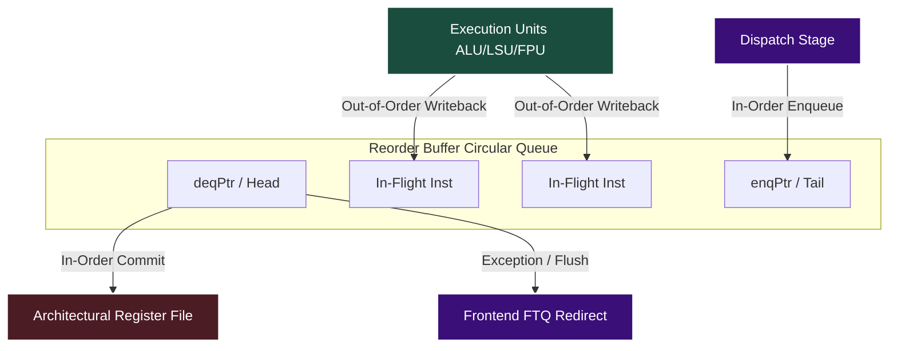

# Reorder Buffer (ROB) Architecture

## Overview
The Reorder Buffer (ROB) is the backbone of Zaqal's superscalar Out-of-Order (OoO) execution engine. While instructions are dispatched and executed out-of-order, they must update the architectural state (registers, memory, exceptions) strictly **in-order**. The ROB guarantees this by serving as a massive circular queue that tracks the lifecycle of every in-flight instruction.

## Detailed Workflow

1. **Enqueue (Dispatch)**: 
   During the Dispatch stage, instructions are allocated an entry at the ROB's `enqPtr` (tail). Up to 6 instructions can be enqueued simultaneously to match the processor's decode/dispatch width.
2. **Execute & Writeback**:
   Instructions wait in the Issue Queues, execute out-of-order, and then broadcast their results on the Wakeup Bus. Simultaneously, the execution units send a writeback signal to the ROB to mark their specific entry as completed (`commit_w`).
3. **Commit (Graduation)**:
   The ROB constantly examines the `deqPtr` (head). If the oldest instructions are marked as complete and have no exceptions, they are "graduated." Their results are permanently written to the architectural register files, and the `deqPtr` increments.
4. **Exceptions & Rollbacks**:
   If an instruction at the `deqPtr` raised an exception or triggered a branch misprediction rollback, the ROB suppresses the commit, flushes all younger speculative instructions by resetting the `enqPtr`, and signals the frontend (FTQ) to redirect fetching.

## Architecture Diagram

## GTKWave Observability
To trace ROB operation in GTKWave:
* `TOP.Core.backend.rob.enqPtr`: The tail pointer allocating new ops.
* `TOP.Core.backend.rob.deqPtr`: The head pointer attempting to graduate ops.
* `TOP.Core.backend.rob.io_robFull`: Asserts if the buffer is saturated.
* `TOP.Core.backend.rob.io_commits_commitValid`: Valid graduation signals to the register file.
