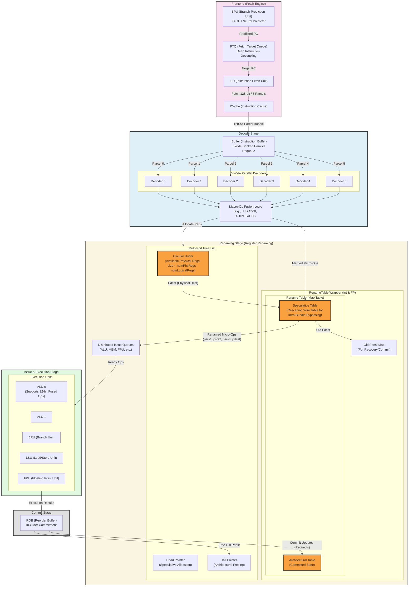

# Zaqal Architecture: Instruction Flow, Decoding, and Renaming

This document describes the high-level flow of instructions through the Zaqal processor. It provides a deeply detailed look at the 6-wide decoding stage, the macro-op fusion logic, and the intricacies of the superscalar renaming stage (including the Map Tables and Free Lists).

## Mermaid.js Diagram

Copy the code below into [Mermaid Live Editor](https://mermaid.live/) to view the diagram.

## Renaming Stage Details

1.  **6-Wide Decoding**: The IBuffer outputs 6 parcels which are decoded in parallel.
2.  **Fusion Logic**: The fusion logic looks across the decoded bundle. If it spots a `LUI` and `ADDI` targeting the same register (e.g., at Decoder 0 and Decoder 2), it merges the immediate values into the `LUI` instruction and marks the `ADDI` instruction to be "fused away" (ignored).
3.  **Free List Allocation**:
    - Uses a circular buffer holding available physical registers.
    - Speculative execution advances the `Head Pointer` to allocate a `Pdest` for valid instructions.
    - Fused-away instructions do *not* request a register, saving physical register space.
4.  **Rename Table (Map Table)**:
    - Divided into `Int` and `FP` wrappers.
    - **Intra-Bundle Bypassing**: Uses a cascading wire table (`curr_spec_table`) so if Decoder 1 depends on Decoder 0's result, it instantly sees the newly allocated physical register.
    - The `Architectural Table` tracks the true, non-speculative state updated only upon ROB commitment.
    - Stores the `Old Pdest` so that if a branch mispredicts, the ROB knows which physical register to return to the Free List.
