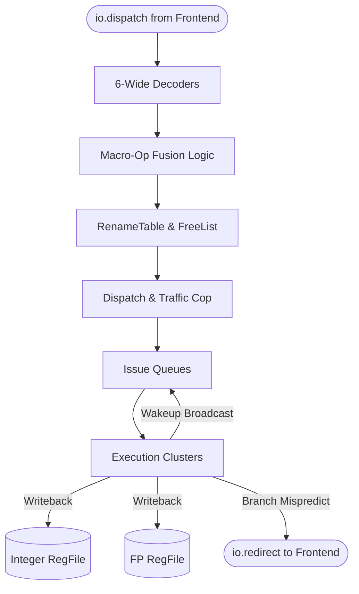

# Backend Top Module

## 1. Overview
The `Backend` module serves as the primary wrapper for Zaqal's out-of-order execution engine. It receives pre-fetched micro-ops from the frontend, routes them through Decode, Rename, and Dispatch, and manages the distributed Execution Clusters, Register Files, and Commit logic. It also contains the top-level combinational logic for Macro-Op Fusion.

## 2. Detailed Diagram

## 3. Configuration & Sizes
- **Decode/Rename/Dispatch Width**: 6-wide superscalar pipeline.
- **Physical Registers**: 192 Integer, 192 FP.
- **Wakeup Ports**: 5 parallel ports.

## 4. Key Internal Logic
- **Pipeline Assembly**: Physically wires the decoupled interfaces of all major backend stages together.
- **Macro-Op Fusion**: Embedded directly after the Decoders. It combinationally merges adjacent instructions (e.g., LUI + ADDI) by modifying their intermediate bundles before they hit the Rename stage, effectively saving a physical register and an execution cycle.

## 5. GTKWave Signals for Debugging
- `TOP.Core.backend.io_dispatch_0_valid`
- `TOP.Core.backend.io_redirect_valid`
- `TOP.Core.backend.uops_0_is_fused_lui_addi` (Trace fusion hits)
