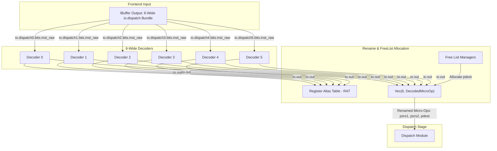

# Decoder Stage

## 1. Overview
The Decoder stage maps raw 32-bit instructions (which are RVC-expanded if they were compressed) to internal control bundles (`DecodeSignals`). It parses opcodes, generates immediates, flags architectural register usage, and identifies operation types. 

In Zaqal's 6-wide pipeline, the backend instantiates a vector of **6 decoders** in parallel to decode up to 6 instructions per cycle.

---

## 2. 6-Wide Decoder Pipeline & Rename Routing

The following diagram illustrates how the 6 parallel decoders process a fetch bundle and route their outputs to the Rename stage:



---

## 3. After Decoders: Where Do the Signals Go?

Immediately after the decoding step, the decoded signals enter the **Rename Stage**. Here is how the information flows step-by-step:

1. **Decoder Extraction**: Each decoder `i` extracts the logical register fields (`rs1`, `rs2`, `rd`) and instruction flags.
2. **Rename Lookup**: The logical source registers (`rs1`, `rs2`, `rs3`) are sent to the Register Alias Table (`rat`):
   ```scala
   rat.io.dec(i) := decoders(i).io.out
   ```
3. **Physical Register Retrieval**: The `rat` returns the physical register tags currently mapped to those logical registers. These are written into the renamed micro-op bundle:
   ```scala
   decoded_uops(i).psrs1 := rat.io.psrs1(i)
   decoded_uops(i).psrs2 := rat.io.psrs2(i)
   decoded_uops(i).psrs3 := rat.io.psrs3(i)
   ```
4. **Physical Destination Allocation**: If the instruction writes to a register (`rf_wen` or `fp_wen`), the `FreeList` allocates a new physical register (`pdest`), which is mapped in the RAT:
   ```scala
   decoded_uops(i).pdest := MuxCase(0.U, Seq(
     intFreeList.io.allocateReq(i) -> intFreeList.io.allocatePhyReg(i),
     fpFreeList.io.allocateReq(i)  -> fpFreeList.io.allocatePhyReg(i)
   ))
   
   rat.io.renamePorts(i).wen  := io.dispatch(i).fire && (rf_wen || fp_wen)
   rat.io.renamePorts(i).addr := dec.rd
   rat.io.renamePorts(i).data := decoded_uops(i).pdest
   ```
5. **Dispatch Routing**: The completed `DecodedMicroOp` bundle (containing both decoded control flags and physical registers) is passed to the **Dispatch stage**, which directs them to the correct issue queues.

---

## 4. Chisel Source Implementation

In [`Backend.scala`](file:///wsl.localhost/Ubuntu/home/emerald/zaqal/backend/src/zaqal/backend/Backend.scala), the 6 decoders are instantiated and wired as follows:

```scala
  // Instantiate 6 decoders in a vector
  val decoders = Seq.fill(decodeWidth)(Module(new Decoder))

  // Connect decoders to raw instruction bits and rename table
  for (i <- 0 until decodeWidth) {
    val dec = decoded_uops(i).decode
    
    // Connect input raw instruction from IBuffer output
    decoders(i).io.inst := io.dispatch(i).bits.inst_raw
    
    // Save decoded control signals into the uop pipeline registers
    decoded_uops(i).decode := decoders(i).io.out
    decoded_uops(i).uop := io.dispatch(i).bits
    
    // Connect decoded register numbers directly to Rename Table read ports
    rat.io.dec(i) := dec
  }
```

---

## 5. GTKWave Signals for Debugging
- `TOP.Core.backend.decoders_0.io_inst[31:0]` (through `decoders_5`)
- `TOP.Core.backend.decoders_0.io_out_is_add` (ALU add operation flag)
- `TOP.Core.backend.decoders_0.io_out_imm[63:0]` (Parsed immediate)
- `TOP.Core.backend.decoders_0.io_out_rd[4:0]` (Logical destination register)
- `TOP.Core.backend.decoders_0.io_out_rs1[4:0]` (Logical source register 1)
