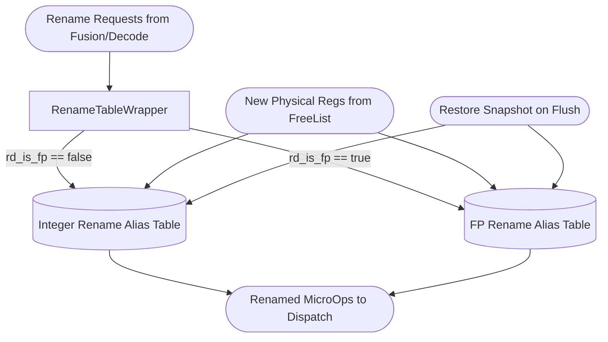

# Rename Tables

## 1. Overview
The Rename stage eliminates false data dependencies by mapping logical (architectural) registers to a larger pool of physical registers. This enables out-of-order execution. The Zaqal architecture uses a `RenameTableWrapper` to route renaming requests to the correct underlying `RenameTable` (Integer vs. Floating-Point) based on the instruction type.

## 2. Detailed Diagram

## 3. Configuration & Sizes
- **Logical Registers**: 32 Integer, 32 Floating-Point.
- **Physical Registers**: 192 total for Integer, 192 total for FP.
- **Rename Width**: 6 instructions per cycle.

## 4. Key Internal Logic
- **Read-After-Write (RAW) Bypassing**: When an instruction reads a logical register that a *preceding* instruction in the exact same 6-wide superscalar packet writes to, the Rename Table uses bypass logic to return the newly allocated physical register, rather than the old mapped value in the table array.
- **Previous Physical Destination (`pprd`)**: Alongside mapping `rd` to a new `prd`, the table tracks what the old mapping was (`pprd`). This is carried through the pipeline to the Commit stage, so the old register can be freed.

## 5. GTKWave Signals for Debugging
- `TOP.Core.backend.rename.io_reqs_0_rd`
- `TOP.Core.backend.rename.io_reqs_0_prd`
- `TOP.Core.backend.rename.io_reqs_0_prs1`
