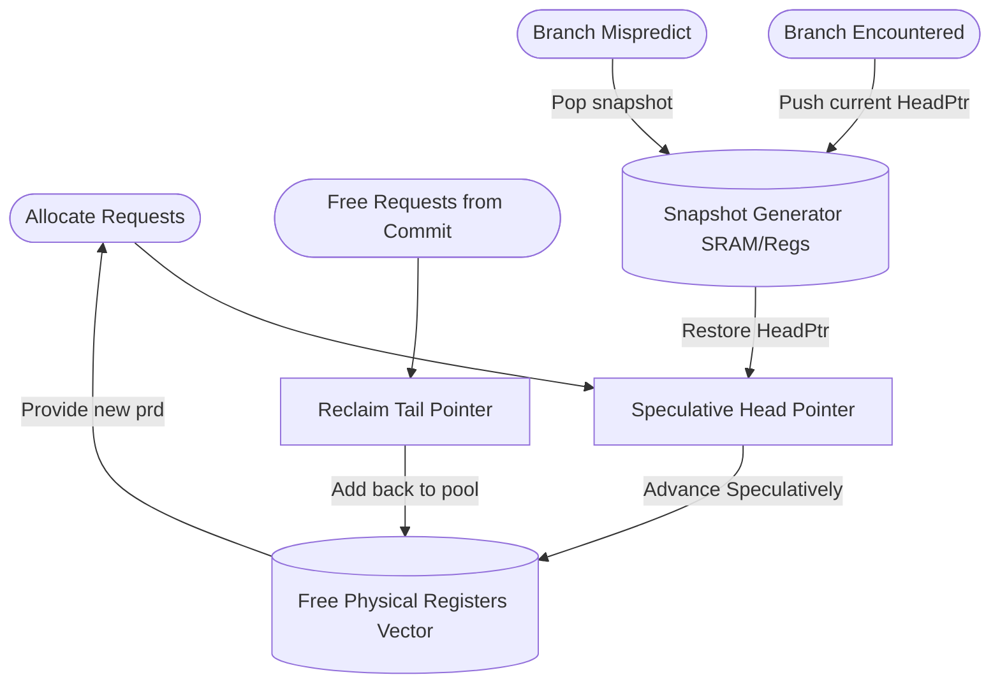

# FreeList & SnapshotGenerator

## 1. Overview
The FreeList maintains a circular buffer of available physical registers to supply the Rename stage. Because branches execute speculatively, the `SnapshotGenerator` continuously takes checkpoints of the FreeList's state. If a branch mispredicts, the FreeList pointer is instantly rolled back to the appropriate snapshot, discarding any wrong-path allocations.

## 2. Detailed Diagram

## 3. Configuration & Sizes
- **Free List Size**: 160 elements (192 total physical regs - 32 logical regs).
- **Snapshot Capacity**: 8 simultaneous checkpoints (`renameSnapshotNum`).
- **Allocation Width**: 6 per cycle.

## 4. Key Internal Logic
- **`wrapAdd` Function**: Circular pointer arithmetic logic that cleanly wraps `headPtr` and `tailPtr` within the 160-element boundary, calculating the `freeCount` by measuring the distance between them.
- **Speculative vs. Architectural**: The `HeadPtr` moves immediately during Rename (speculative). The `TailPtr` only moves during Commit (architectural, non-speculative).
- **Flash Recovery**: Reverting the `HeadPtr` via the snapshot recovers all wrong-path physical registers in a single cycle.

## 5. GTKWave Signals for Debugging
- `TOP.Core.backend.rename.freeList_int.freeCount`
- `TOP.Core.backend.rename.freeList_int.headPtr`
- `TOP.Core.backend.rename.freeList_int.snapshots.io_enq`
- `TOP.Core.backend.rename.freeList_int.snapshots.io_redirect`
