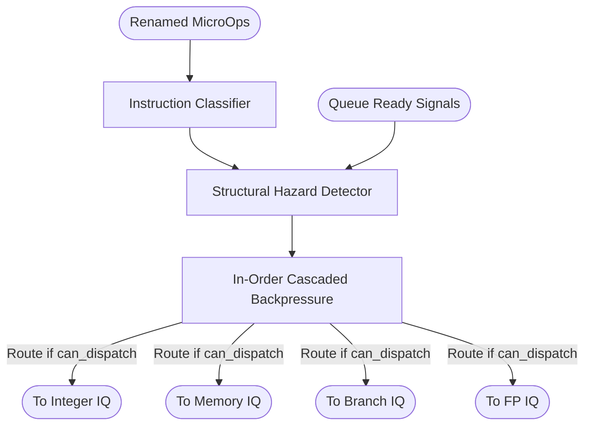

# Dispatch & Traffic Cop

## 1. Overview
The Dispatch stage receives up to 6 renamed micro-ops per cycle and routes them to distributed issue queues (ALU, MEM, BRU, FPU). It actively checks for structural hazards and applies in-order cascaded backpressure to the pipeline if any queue is full or if resource limits for a given cycle are exceeded.

## 2. Detailed Diagram

## 3. Configuration & Sizes
- **Input Bandwidth**: 6 instructions per cycle.
- **Output Interfaces**: 4 parallel `Vec(decodeWidth, Decoupled(MicroOp))` bundles mapping to the target queues.
- **Resource Constraints**:
  - `max_alu_units` = 1
  - `max_mem_units` = 1
  - `max_bru_units` = 1
  - `max_fpu_units` = 1
  - `max_total_ports` = 1 (Currently restricts issue to a scalar 1-wide mode per cluster, configurable for superscalar scaling).

## 4. Key Internal Logic
- **Shadow Slots**: Slots 1, 3, and 5 can act as shadow buffers for 32-bit instructions taking up two 16-bit boundaries, identified using the `is_rvc` flag.
- **Hazard Accumulation**: The module counts how many ALU, MEM, BRU, and FPU requests exist from lane 0 up to lane 5. If a request exceeds the `max_*_units`, a hazard is detected for that specific lane.
- **Cascaded Stalls**: If lane `i` experiences a hazard or a queue full signal, `can_dispatch(i)` is false. This forces all subsequent lanes `can_dispatch(j)` (where $j > i$) to also be false, ensuring strict program ordering into the issue queues.

## 5. GTKWave Signals for Debugging
- `TOP.Core.backend.dispatch.io_in_0_valid`
- `TOP.Core.backend.dispatch.hazard_detected_0`
- `TOP.Core.backend.dispatch.can_dispatch_0`
- `TOP.Core.backend.dispatch.io_aluOut_0_valid`
