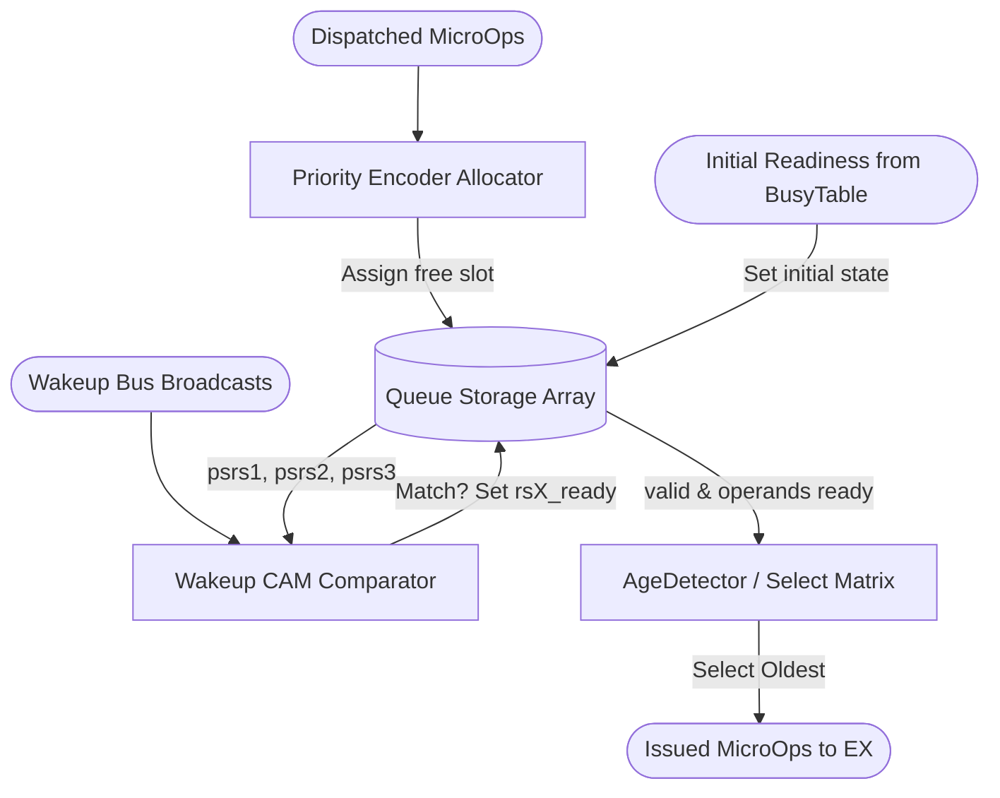

# Issue Queues

## 1. Overview
The distributed Issue Queues (`intIq`, `memIq`, `fpIq`) buffer dispatched micro-ops until all source operands are ready. Using a combination of Content-Addressable Memory (CAM) for wakeup monitoring and an `AgeDetector` for scheduling, they enforce out-of-order execution while respecting data dependencies.

## 2. Detailed Diagram

## 3. Configuration & Sizes
- **Integer Queue (`intIq`)**: 16 entries.
- **Memory Queue (`memIq`)**: 8 entries.
- **Floating-Point Queue (`fpIq`)**: 8 entries.
- **Wakeup Ports**: 5 parallel `WakeupBus` inputs.

## 4. Key Internal Logic
- **Operand Tracking**: Each entry tracks `valid`, `rs1_ready`, `rs2_ready`, and `rs3_ready`.
- **CAM Wakeup**: Every cycle, the queue compares the physical source registers of all valid entries against the 5 `pdest` values broadcast on the `wakeup_bus`. Matches assert the `rsX_ready` flags.
- **Select / Arbitration**: When an entry is valid and all required operands are ready, it requests issue. The `AgeDetector` guarantees that if multiple instructions request issue, the oldest one (the one enqueued first) wins arbitration.
- **Branch Flush**: The `btb_redirect` signal instantly invalidates the entire queue upon a misprediction.

## 5. GTKWave Signals for Debugging
- `TOP.Core.backend.intIq.entries_0_valid`
- `TOP.Core.backend.intIq.entries_0_rs1_ready`
- `TOP.Core.backend.intIq.io_deq_0_valid`
- `TOP.Core.backend.intIq.io_wakeup_0_pdest`
