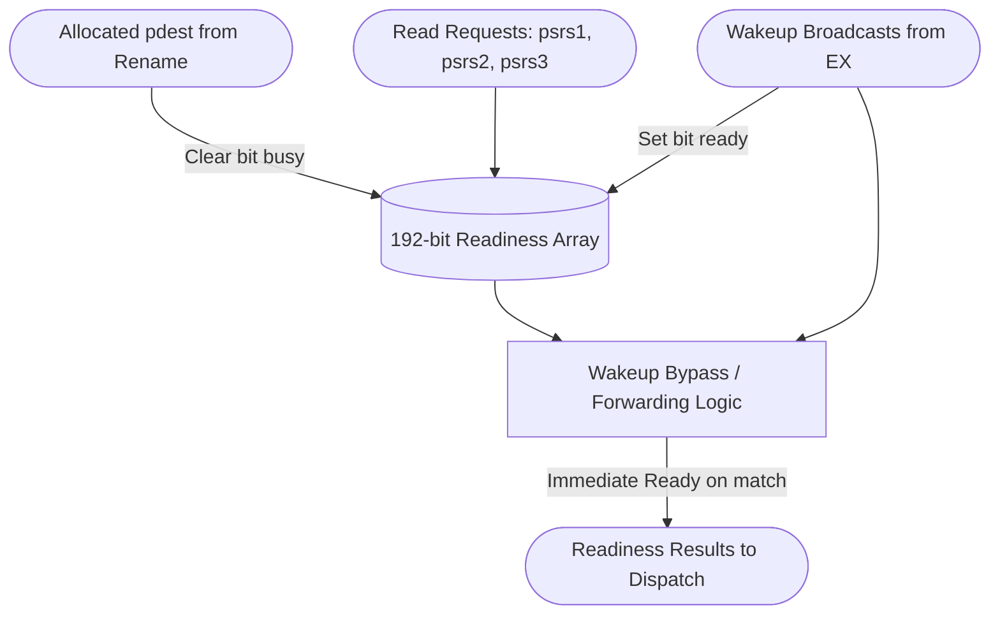

# BusyTable

## 1. Overview
The BusyTable is a 192-bit scoreboard array that tracks the execution readiness of every physical register. During dispatch, instructions query the BusyTable to initialize their operands' ready status. When instructions are allocated new physical destinations during renaming, the corresponding bit in the BusyTable is cleared (marked busy). When an execution unit broadcasts a completed register on the Wakeup Bus, the bit is set (marked ready).

## 2. Detailed Diagram

## 3. Configuration & Sizes
- **Size**: 192 bits (covering `phyRegs`).
- **Read Ports**: $6 \times 3 = 18$ asynchronous read ports for the 6-wide dispatch pipeline.
- **Set Ports**: Up to 6 parallel set ports during allocation.
- **Clear Ports**: 5 parallel clear ports attached to the Wakeup Bus.

## 4. Key Internal Logic
- **Bypass / Forwarding**: If a physical register is being read by dispatch in the exact same cycle it is being broadcast on the Wakeup Bus, the BusyTable bypasses the internal array and returns `ready = true`. This prevents instructions from needlessly stalling in the Issue Queue for one cycle.
- **Priority Resolution**: If a register is simultaneously allocated (marked busy) and woken up (marked ready), the allocation takes precedence for future reads, though this scenario is primarily an artifact of branch recovery.

## 5. GTKWave Signals for Debugging
- `TOP.Core.backend.busyTable.table_X` (Where X is the physical register)
- `TOP.Core.backend.busyTable.io_pdest_set_0`
- `TOP.Core.backend.busyTable.io_wakeup_0_pdest`
