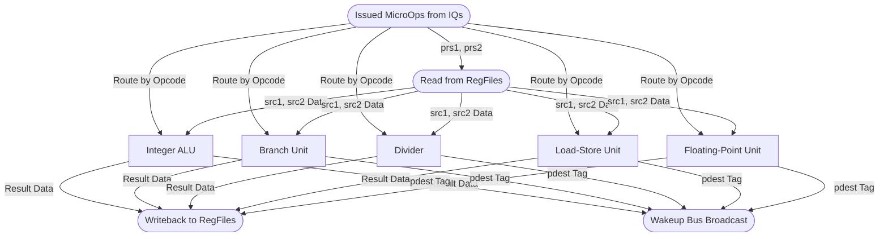

# Execute Top Module

## 1. Overview
The `Execute` module wraps all the functional execution units (ALU, BRU, Divider, LSU, FPU). It reads operands directly from the Physical Register Files based on the instructions issued from the queues, routes the data to the correct functional unit, and collects the writeback data and wakeup broadcasts to feed back into the pipeline.

## 2. Detailed Diagram

## 3. Configuration & Sizes
- **Issue Ports**: Tied to the specific Issue Queues (e.g., Integer IQ feeds ALU/BRU/Divider).
- **Wakeup Ports**: 5 output ports broadcast globally.
- **Writeback Ports**: 5 integer ports, 3 FP ports.

## 4. Key Internal Logic
- **Operand Fetching**: In Zaqal, operands are fetched *after* issue, directly from the unified physical register file. The `Execute` wrapper manages this routing.
- **Port Arbitration**: For long-latency units (like the Divider), the wrapper monitors the `io.done` signal to arbitrate access to the shared writeback ports when the result finally completes.

## 5. GTKWave Signals for Debugging
- `TOP.Core.backend.execute.io_wakeup_0_valid`
- `TOP.Core.backend.execute.io_wakeup_0_pdest`
- `TOP.Core.backend.execute.alu_0.io_result`
