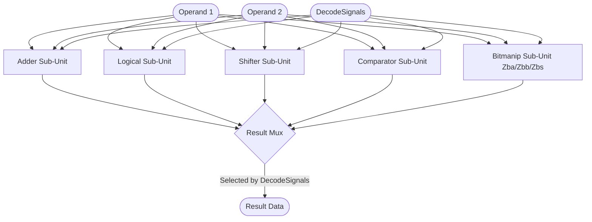

# ALU (Arithmetic Logic Unit)

## 1. Overview
The ALU is the primary integer execution unit, handling arithmetic, logical, shift, comparison, and bit manipulation instructions. It evaluates all these operations combinationally in a single cycle.

## 2. Detailed Diagram

## 3. Configuration & Sizes
- **Datapath**: 64-bit (`xLen`).
- **Latency**: 1 cycle.

## 4. Key Internal Logic
- **Sub-module Delegation**: The ALU delegates specific operations to dedicated sub-modules (e.g., `Adder.scala`, `Shifter.scala`).
- **Bitmanip Extension (Zba, Zbb, Zbs)**: Zaqal explicitly supports advanced bit manipulation. The `Bitmanip` submodule handles operations like `CLZ` (Count Leading Zeros), `CPOP` (Population Count), single-bit sets/clears, and `MIN/MAX` instructions. `Zba` address generation (e.g., `SH1ADD`) is handled directly in the ALU's combinational datapath.
- **Result Mux**: A large `MuxCase` selects the final 64-bit output by matching the `DecodeSignals` (e.g., `is_add`, `is_slt`, `is_clz`) against the sub-module outputs.

## 5. GTKWave Signals for Debugging
- `TOP.Core.backend.execute.alu_0.io_src1`
- `TOP.Core.backend.execute.alu_0.io_src2`
- `TOP.Core.backend.execute.alu_0.io_result`
- `TOP.Core.backend.execute.alu_0.adder.io_result`
