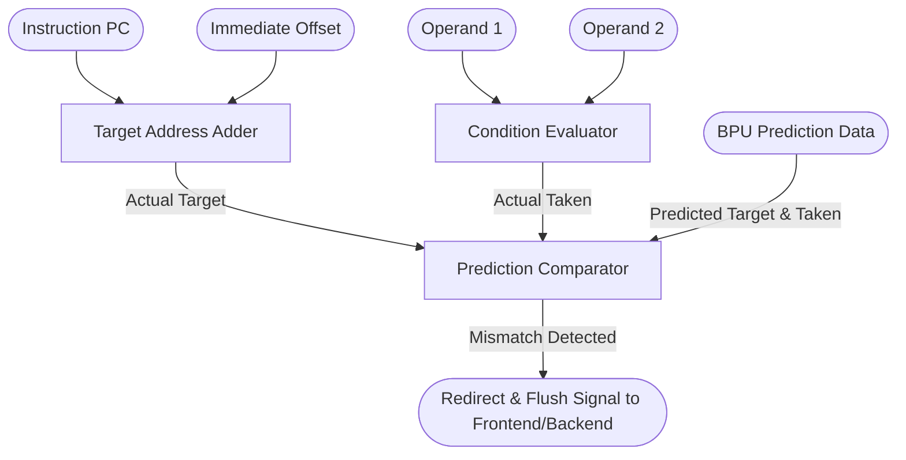

# Branch Resolution Unit (BRU)

## 1. Overview
The Branch Resolution Unit (BRU) computes branch targets and evaluates branch conditions. Most importantly, it compares its calculated outcome against the prediction made by the Frontend BPU. If a mismatch occurs, it immediately triggers a pipeline redirect.

## 2. Detailed Diagram

## 3. Configuration & Sizes
- **Latency**: 1 cycle.
- **Datapath**: 64-bit.

## 4. Key Internal Logic
- **Condition Evaluation**: Handles all conditional branches (`BEQ`, `BNE`, `BLT`, `BGEU`, etc.) by comparing `src1` and `src2`.
- **Target Generation**: Adds the `pc` and `imm` for branches and `JAL`. Adds `src1` and `imm` for `JALR`.
- **Misprediction Detection**: It verifies two things:
  1. Did the branch actually take the same direction as predicted?
  2. If taken, did it jump to the exact same target address as predicted?
- **Redirect Signal**: If either check fails, `io.redirect_valid` is asserted, flushing the pipeline and restoring the FreeList `headPtr` from the associated snapshot.

## 5. GTKWave Signals for Debugging
- `TOP.Core.backend.execute.bru_0.io_redirect_valid`
- `TOP.Core.backend.execute.bru_0.io_redirect_target`
- `TOP.Core.backend.execute.bru_0.actual_taken`
