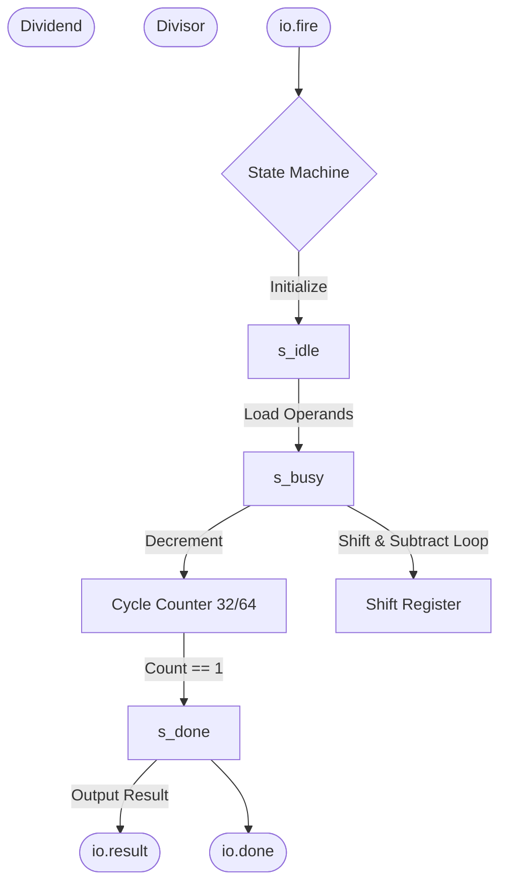

# Divider Unit

## 1. Overview
The Divider is a multi-cycle functional unit responsible for executing integer division and remainder instructions (`DIV`, `DIVU`, `REM`, `REMU`, and their 32-bit `*W` variants). Because division is an iterative process, this unit operates asynchronously to the rest of the 1-cycle pipeline.

## 2. Detailed Diagram

## 3. Configuration & Sizes
- **Latency**: Variable based on precision.
  - **32-bit (W instructions)**: 32 cycles.
  - **64-bit**: 64 cycles.
- **Algorithm**: Non-restoring / Restoring shift-and-subtract state machine.

## 4. Key Internal Logic
- **Handshake Protocol**: The Issue Queue issues the instruction to the Divider, asserting `io.fire`. The instruction leaves the issue queue but its destination register remains "busy" in the `BusyTable`. The `Execute` wrapper monitors the Divider's `io.done` signal to eventually capture the result.
- **Sign Handling**: The divider absolute-values the operands, performs unsigned division iteratively, and then correctly applies the IEEE RISC-V sign rules to the final quotient and remainder depending on the signs of the original inputs.
- **Edge Cases**: Explicitly handles divide-by-zero (returning -1 or dividend) and signed overflow (`-2^63 / -1`) per the RISC-V specification.

## 5. GTKWave Signals for Debugging
- `TOP.Core.backend.execute.divider_0.state`
- `TOP.Core.backend.execute.divider_0.count`
- `TOP.Core.backend.execute.divider_0.io_done`
