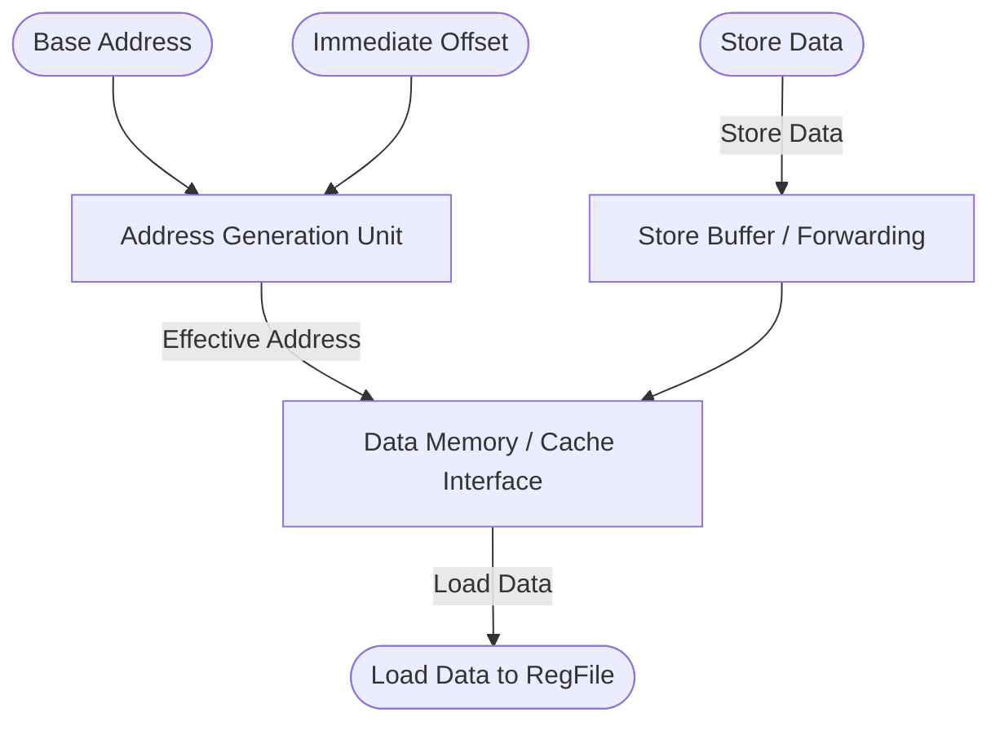

# Load-Store Unit (LSU)

## 1. Overview
The Load-Store Unit (LSU) handles all memory access instructions (`LW`, `SW`, `LD`, `SD`, Atomics, etc.). It calculates the effective memory address and interfaces directly with the L1 Data Cache (or `DataMem` in simulation).

## 2. Detailed Diagram

## 3. Configuration & Sizes
- **Address Space**: 64-bit virtual/physical addresses.
- **Data Path**: 64-bit.
- **Supported Ops**: Byte, Half, Word, Double-word accesses. Zero-extension vs Sign-extension configurations.

## 4. Key Internal Logic
- **AGU (Address Generation Unit)**: A dedicated adder that computes `src1 + imm` independent of the main integer ALU.
- **Memory Ordering**: Stores wait until commit to become visible to the memory system. Loads can execute speculatively but must check in-flight stores for address conflicts. If a match occurs, data is forwarded directly from the store buffer to the load to satisfy Read-After-Write (RAW) dependencies without going to L1 cache.

## 5. GTKWave Signals for Debugging
- `TOP.Core.backend.execute.lsu_0.io_req_addr`
- `TOP.Core.backend.execute.lsu_0.io_req_data`
- `TOP.Core.backend.execute.lsu_0.io_resp_data`
