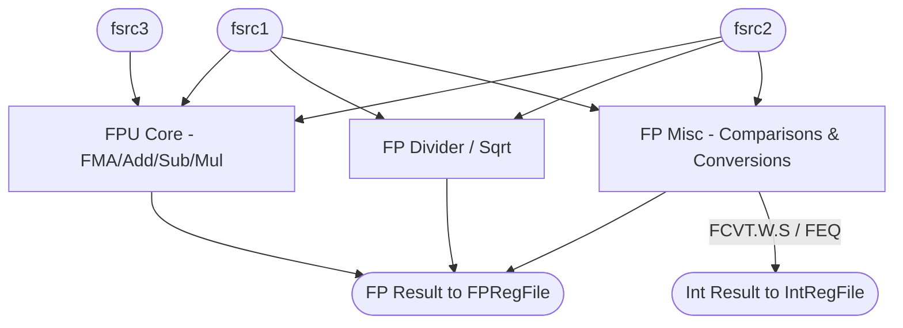

# Floating-Point Units (FPU)

## 1. Overview
The Floating-Point execution logic is divided into specialized modules tailored to specific instruction latencies and types. This prevents slow iterative operations from stalling fast combinational arithmetic. 

## 2. Detailed Diagram

## 3. Configuration & Sizes
- **Datapath**: IEEE-754 Single (32-bit) and Double (64-bit) precision support (`fLen`).
- **Latencies**:
  - `FPMisc`: 1 cycle.
  - `FPU` (Pipelined): Configurable (typically 3-4 cycles for FMA).
  - `FPDiv` / `FPSqrt`: Multi-cycle iterative (10-30 cycles depending on precision).

## 4. Key Internal Logic
- **Fused Multiply-Add (FMA)**: Implements $A \times B + C$ efficiently. FMA requires three source operands (`rs1`, `rs2`, `rs3`), dictating the 3-read-port design of the Issue Queues and FPRegFile.
- **FCSR (Floating-Point Control and Status Register)**: Tracks rounding modes (RNE, RTZ, RDN, RUP, RMM) and exception flags (NV, DZ, OF, UF, NX). The FCSR is accessed via the `FPMisc` unit for `fcsr` read/write instructions.
- **Cross-Domain Writebacks**: The `FPMisc` unit handles instructions like `FCVT.W.S` (Float to Integer) and `FEQ` (Float Compare). These instructions consume FP operands but must write their results back to the *Integer* Physical Register File.

## 5. GTKWave Signals for Debugging
- `TOP.Core.backend.execute.fpu_0.io_result`
- `TOP.Core.backend.execute.fpmisc_0.io_int_result`
- `TOP.Core.backend.execute.fpdiv_0.state`
