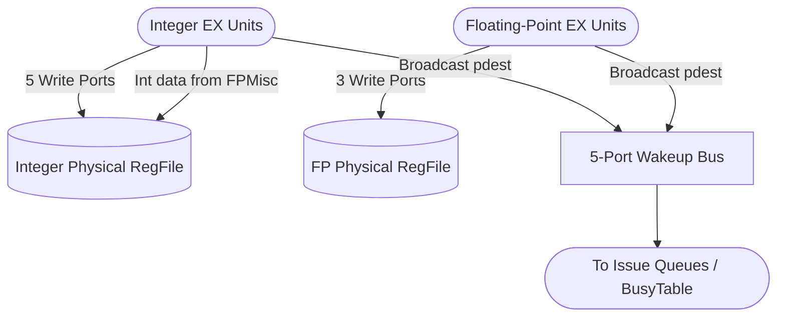

# Register Files & Wakeup Bus

## 1. Overview
The Register File stage physically stores the data for all architectural logical registers and in-flight speculative physical registers. Zaqal employs a unified physical register file architecture. When execution units finish computation, they write data into these arrays and simultaneously broadcast the physical register ID on the Wakeup Bus to unblock dependent instructions.

## 2. Detailed Diagram

## 3. Configuration & Sizes
- **Integer RegFile**:
  - `phyRegs`: 192 registers.
  - Ports: 7 Read / 5 Write.
  - Data Width: 64-bit.
- **Floating-Point RegFile**:
  - `phyRegs`: 192 registers.
  - Ports: 4 Read / 3 Write.
  - Data Width: 64-bit (`fLen`).
- **Wakeup Bus**:
  - 5 parallel output ports to handle peak superscalar writeback scenarios.

## 4. Key Internal Logic
- **Bypass / Forwarding**: Reading a register in the exact cycle it is being written returns the new value, handled via combinational bypass muxes in the `Execute` wrapper or internal to the `RegFile` interface.
- **Hardwired Zero**: For the Integer RegFile, physical register 0 is permanently mapped to the value `0`. Any read to `p0` returns `0`, and any write to `p0` is silently ignored. The FP RegFile does not enforce this, as floating-point zero requires a specific IEEE-754 representation and `f0` is a general-purpose register.

## 5. GTKWave Signals for Debugging
- `TOP.Core.backend.regFile.regs_X`
- `TOP.Core.backend.regFile.io_wdata_0`
- `TOP.Core.backend.fpRegFile.regs_X`
- `TOP.Core.backend.execute.io_wakeup_0_pdest`
