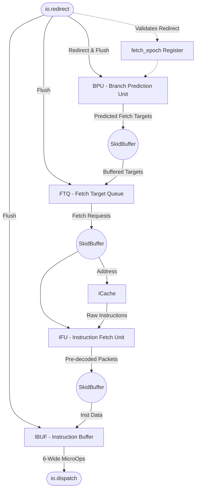

# Frontend Top Module

## 1. Overview
The `Frontend` module serves as the root integration point for all instruction fetch, prediction, and buffering mechanisms. It wires together the BPU, FTQ, IFU, ICache, and IBuffer, coordinating the complex decoupled handshakes between them. It is strictly responsible for feeding a steady stream of `MicroOp` instructions to the backend `Dispatch` interface.

## 2. Detailed Diagram

## 3. Configuration & Sizes
- **Fetch Width**: 8 (`fetchWidth` in `ZaqalParams`).
- **Decode Width**: 6 (`decodeWidth`).
- **Epoch Tracking**: A 1-bit `fetch_epoch` register tracking the current valid instruction stream to drop stale redirects.

## 4. Data Interfaces
### Inputs
- `io.redirect`: Resolves branch mispredictions from the Backend Execution units, providing a valid flush target and an epoch bit.
- `io.ftq_read_ptr`: Pointer allowing the backend to read metadata from the FTQ during rename/commit.

### Outputs
- `io.dispatch`: A 6-wide vector of `Decoupled(MicroOp)` feeding the backend decoders.
- `io.ftq_read_data`: Outputs the metadata associated with the provided `ftq_read_ptr`.

## 5. Key Internal Logic
- **Skid Buffers**: Inserted between major module boundaries (`BPU -> FTQ`, `FTQ -> IFU/ICache`, `IFU -> IBUF`) to improve timing paths and decouple handshakes.
- **Epoch Management**: The `fetch_epoch` toggles upon a valid redirect. Instructions moving through the pipeline carry this epoch. If a redirect arrives with an epoch that does not match `fetch_epoch`, it is ignored as an outdated redirect.

## 6. GTKWave Signals for Debugging
- `TOP.Core.frontend.io_redirect_valid`
- `TOP.Core.frontend.fetch_epoch`
- `TOP.Core.frontend.ftq.io_toIfu_valid`
- `TOP.Core.frontend.ibuf.io_inst_data_valid`
