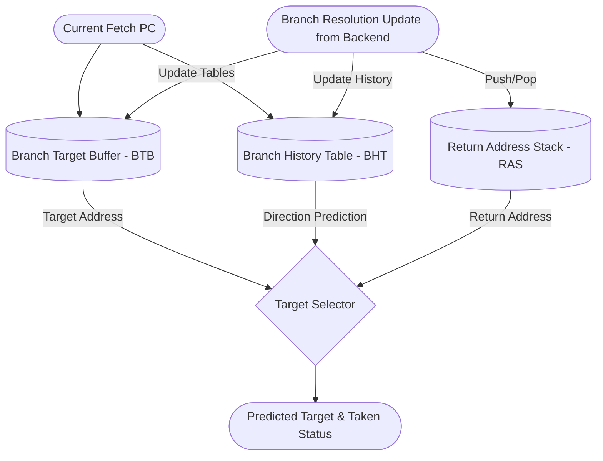

# Branch Prediction Unit (BPU)

## 1. Overview
The Branch Prediction Unit (BPU) is responsible for speculative control flow prediction. It attempts to guess the outcome (taken/not-taken) and the target address of branch and jump instructions before they are actually fetched or decoded.

## 2. Detailed Diagram

## 3. Sub-Components & Sizes
- **BTB (Branch Target Buffer)**: Caches the target addresses of previously taken branches.
- **BHT (Branch History Table)**: Tracks the taken/not-taken history patterns to predict conditional branch directions.
- **RAS (Return Address Stack)**: A specialized LIFO stack optimizing `JALR` instructions used for function returns (`ret`), ensuring highly accurate return targets.

## 4. Data Interfaces
### Inputs
- `io.redirect`: Receives branch resolution updates from the backend execution units (e.g., BRU), correcting mispredictions and updating predictor state.

### Outputs
- `io.out`: Outputs a decoupled stream of prediction bundles specifying the predicted next `pc`, the `mask` for fetch, and whether a branch was predicted `taken` in this fetch block.

## 5. Key Internal Logic
- **Speculative Fetch Streaming**: The BPU acts autonomously, continuously streaming predicted fetch PCs into the FTQ based on its internal state, driving the entire frontend pipeline.
- **RAS Push/Pop**: Function calls (`JAL`/`JALR` with `rd=ra`) push the return address (PC+4) onto the RAS. Function returns pop the address, bypassing the BTB for absolute precision.

## 6. GTKWave Signals for Debugging
- `TOP.Core.frontend.bpu.io_out_bits_pc`
- `TOP.Core.frontend.bpu.io_out_bits_prediction_taken`
- `TOP.Core.frontend.bpu.btb.io_hit`
- `TOP.Core.frontend.bpu.ras.io_push` / `io_pop`
