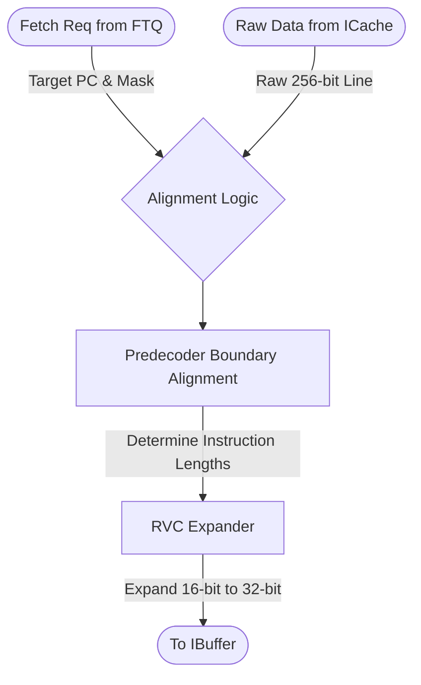

# Instruction Fetch Unit (IFU)

## 1. Overview
The Instruction Fetch Unit (IFU) is the execution engine of the frontend. It consumes fetch requests directed by the FTQ, coordinates with the ICache to retrieve raw instruction data, aligns the incoming bytes into valid instruction boundaries via the Predecoder, and expands compressed instructions before delivering them to the IBuffer.

## 2. Detailed Diagram

## 3. Configuration & Sizes
- **Fetch Width**: 8 instructions (`fetchWidth`).
- **Data Width**: Receives up to 8 raw 32-bit instruction slots from the ICache per cycle.

## 4. Data Interfaces
### Inputs
- `io.fetch_req`: Receives the requested PC and mask from the FTQ.
- `io.icache_ready`: Handshake signal indicating the ICache has successfully serviced the request.
- `io.insts_in`: Array of raw instruction bits returned by the ICache.

### Outputs
- `io.toIbuffer`: Outputs the processed `FetchPacket` (with expanded RVC instructions and aligned PCs) to the IBuffer.

## 5. Key Internal Logic
- **Alignment Handling**: Since fetch blocks may not perfectly align with branch targets, the IFU applies the fetch mask to ignore unrequested instructions at the start of the cache line.
- **RVC Expansion**: It instantiates the `RVCExpander` to seamlessly convert 16-bit "C" standard extension instructions into their standard 32-bit RISC-V equivalents, simplifying decoder logic downstream.
- **Predecoding**: It instantiates the `Predecoder` to parse instruction boundaries, ensuring the backend receives clean, contiguous 32-bit payloads regardless of instruction mixture.

## 6. GTKWave Signals for Debugging
- `TOP.Core.frontend.ifu.io_fetch_req_valid`
- `TOP.Core.frontend.ifu.io_insts_in_0` (Raw data)
- `TOP.Core.frontend.ifu.io_toIbuffer_bits_instructions_0` (Expanded data)
