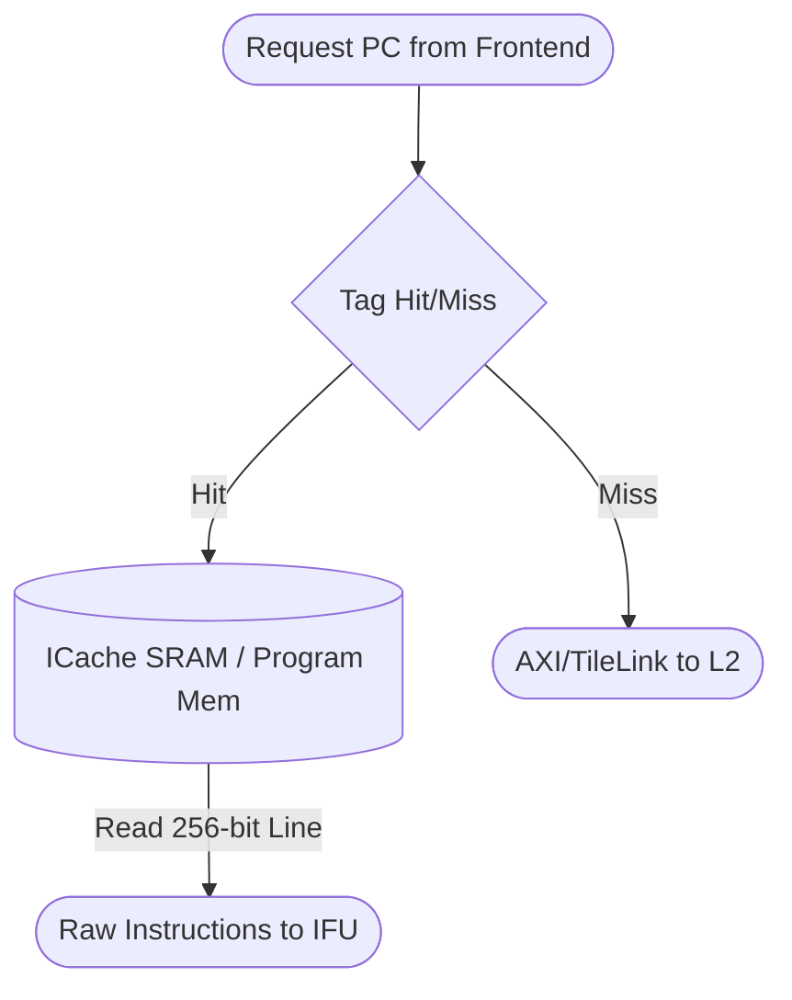

# Instruction Cache (ICache)

## 1. Overview
The Instruction Cache (ICache) is responsible for supplying high-bandwidth instruction data to the IFU. In the current iteration, it serves as a non-blocking functional model that directly feeds an underlying memory bus or simulated program memory, retrieving raw program bytes based on the requested PC.

## 2. Detailed Diagram

## 3. Configuration & Sizes
- **Line Size**: Typically fetches a cache line matching the frontend fetch width (e.g., 8 instructions $\times$ 32 bits = 256 bits).

## 4. Data Interfaces
### Inputs
- `io.pc`: The 64-bit target address requested by the FTQ.

### Outputs
- `io.ready`: Indicates the requested data is available this cycle.
- `io.insts`: The vector of fetched instruction words.

## 5. Key Internal Logic
- **Line Alignment**: Automatically zeroes out the lower bits of the `pc` to fetch aligned cache blocks.
- **Test Mode Overlay**: In simulation, the ICache may include logic to inject specific hardware test programs (e.g., OoO Issue Queue Verification scripts) directly into the stream, overriding normal memory fetches for rapid debug cycles.

## 6. GTKWave Signals for Debugging
- `TOP.Core.frontend.icache.io_pc`
- `TOP.Core.frontend.icache.io_ready`
- `TOP.Core.frontend.icache.io_insts_0`
