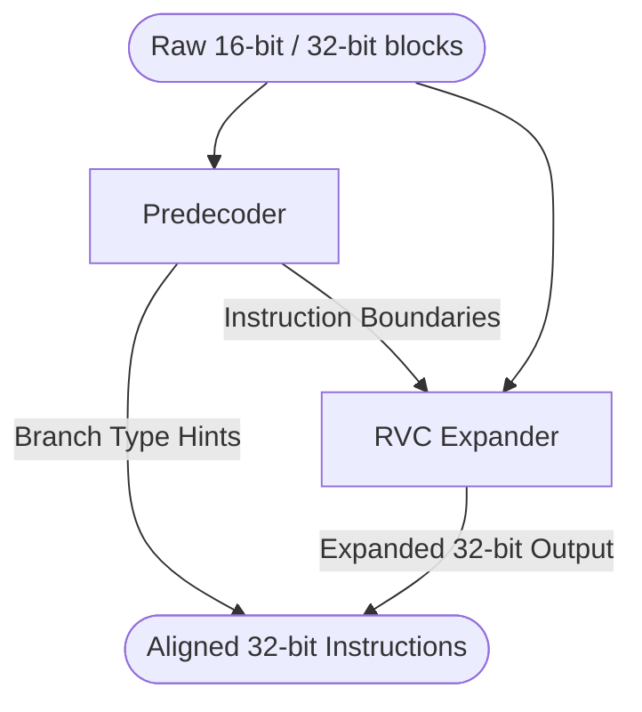

# Predecoder & RVC Expander

## 1. Overview
The Predecoder and RVC Expander logic resides within the instruction fetch datapath (usually instantiated by the IFU). These modules pre-process raw instruction bytes returning from the ICache to detect instruction boundaries and decompress RISC-V Compressed (RVC) instructions before they reach the main decode stage.

## 2. Detailed Diagram

## 3. Configuration & Sizes
- **Input Width**: Operates on the full fetch bandwidth (e.g., eight 32-bit slots).
- **Supported Standards**: Standard RV32/RV64 Base Instruction Set and the "C" (Compressed) Extension.

## 4. Data Interfaces
### Inputs
- Raw instruction data directly from the ICache read ports.

### Outputs
- `is_rvc`: A boolean flag identifying if the original instruction was compressed.
- `expanded_inst`: The decompressed 32-bit equivalent instruction.
- `pre_decoded_info`: Metadata indicating if the instruction is a branch, call, or return (useful for the BPU and fast-path handling).

## 5. Key Internal Logic
- **Predecoding**: Inspects the lower two bits of the incoming instruction block. If `inst(1, 0) != 2'b11`, it identifies the block as a 16-bit compressed instruction. It also does early detection of branch opcodes (`JAL`, `BEQ`, etc.) to generate pre-decode hints.
- **RVC Expansion**: A massive combinational lookup table (`RVCExpander.scala`) that maps compact 16-bit formats (like `C.ADDI4SPN`, `C.LW`, `C.J`) into their exact 32-bit RISC-V representations. This ensures the complex main decoders in the backend only ever have to parse standard 32-bit instructions.

## 6. GTKWave Signals for Debugging
- `TOP.Core.frontend.ifu.predecoder.io_in`
- `TOP.Core.frontend.ifu.expander.io_out_inst`
- `TOP.Core.frontend.ifu.expander.io_out_is_rvc`
