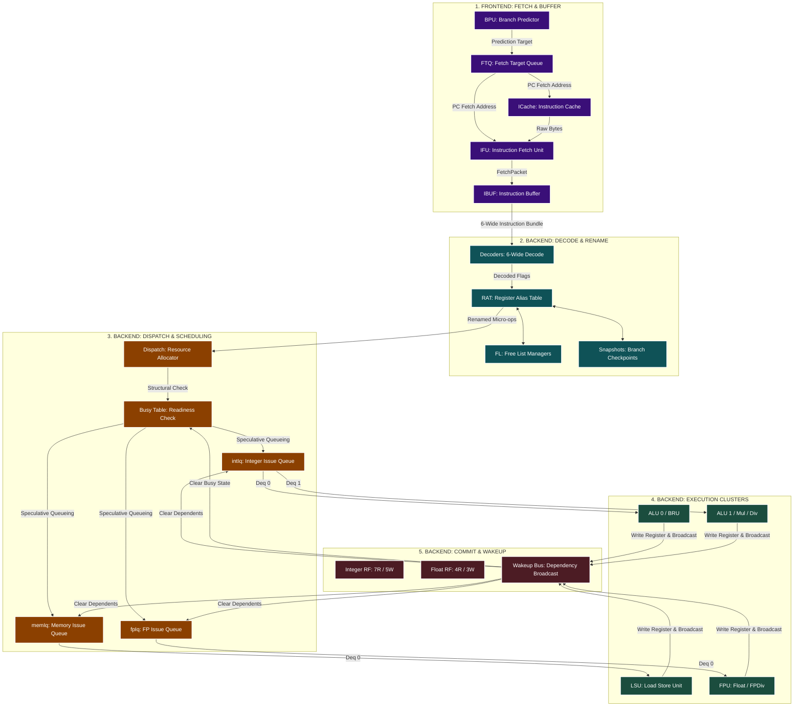

# Zaqal Core Processor Mind Map (Detailed Architecture Guide)

This document serves as a comprehensive, visual, and conceptual mind map of the entire **Zaqal superscalar processor core**. It is specifically structured for beginners to understand how instructions flow, how each module operates, and exactly which signals to look for in **GTKWave** to trace execution.

---

## 1. High-Level Pipeline Flow

Below is the complete hierarchical map of instruction flow from branch prediction through out-of-order queueing and execution.

---

## 2. Module-by-Module Detailed Cards

---

### BPU: Branch Prediction Unit
* **Role**: Predicts whether branches are taken/not-taken and provides the next PC target address. Keeps the pipeline filled speculatively.
* **Size/Parameters**: Standard RV64GC alignment. Currently operates as a simple "predict-not-taken" engine.
* **Input**: Redirect signals from the execution stage (`io.redirect`).
* **Output**: Fetch addresses enqueued to the FTQ.
* **GTKWave Signals to Watch**:
  * `TOP.Core.frontend.bpu.s0_pc[63:0]` (The current fetching PC)
  * `TOP.Core.frontend.bpu.io_redirect_valid` (Redirect assert)
  * `TOP.Core.frontend.bpu.epoch` (The BPU path color)

---

### FTQ: Fetch Target Queue
* **Role**: A circular buffer (64 entries) that holds PC targets and branch prediction metadata from the BPU. Decouples prediction from instruction cache latency.
* **Size/Parameters**: 64 entries. Exposes a 16-port read interface to the backend.
* **Input**: `FetchRequest` from BPU.
* **Output**: Address requests to ICache and metadata readout ports for the backend.
* **GTKWave Signals to Watch**:
  * `TOP.Core.frontend.ftq.writePtr[5:0]` / `readPtr[5:0]`
  * `TOP.Core.frontend.ftq.io_readData_pc_0[63:0]` (PC readout)

---

### ICache & IFU: Fetch Engine
* **Role**: `ICache` retrieves raw instructions from memory based on the PC. `IFU` decodes compressed instructions (RVC 16-bit to standard 32-bit) and packages them into a `FetchPacket`.
* **Input**: PC target from the FTQ.
* **Output**: Aligned 6-wide `FetchPacket` sent to IBuffer.
* **GTKWave Signals to Watch**:
  * `TOP.Core.frontend.icache.io_pc[63:0]` (Requested cache line)
  * `TOP.Core.frontend.ifu.io_toIbuffer_bits_instructions_0[31:0]` (Expanded raw instructions)

---

### IBUF: Instruction Buffer
* **Role**: A 48-entry instruction queue that acts as the barrier between the variable-rate Fetch stage (Frontend) and the fixed-width Decode stage (Backend). 
* **Input**: `FetchPacket` from IFU.
* **Output**: Up to 6 instructions per cycle via `io.out(0)` to `io.out(5)`.
* **GTKWave Signals to Watch**:
  * `TOP.Core.frontend.ibuf.head[5:0]` / `tail[5:0]` (Pointers)
  * `TOP.Core.frontend.ibuf.io_out_0_valid` (Valid dequeue lanes)
  * `TOP.Core.frontend.ibuf.io_out_0_ready` (Backpressure from dispatch)

---

### Decoders (6-Wide)
* **Role**: Parses 6 raw 32-bit instructions in parallel. Extracts registers (`rs1`, `rs2`, `rd`), immediate constants, and identifies the execution unit type.
* **Input**: `inst_raw` from IBuffer output.
* **Output**: Decoded signal bundles (`DecodeSignals`).
* **GTKWave Signals to Watch**:
  * `TOP.Core.backend.decoders_0.io_inst[31:0]` (Decoder 0 raw code)
  * `TOP.Core.backend.decoders_0.io_out_is_add` (Add operation flag)

---

### Rename Stage (RAT, FreeList, Snapshots)
* **Role**: Eliminates false dependencies (Write-After-Read, Write-After-Write) by mapping logical registers (`x0` to `x31`) to a large pool of physical registers (`p0` to `p159`).
* **Components**:
  * **RAT**: Map Table tracking which physical register has the newest value for a logical register.
  * **FreeList**: Tracks which physical registers are free to be allocated.
  * **Snapshots**: Takes a copy of the RAT/FreeList states on every speculative branch. If a branch mispredicts, Zaqal restores the snapshot in **1 cycle**.
* **GTKWave Signals to Watch**:
  * `TOP.Core.backend.rat.io_dec_0_rd[4:0]` (Logical destination register)
  * `TOP.Core.backend.intFreeList.headPtr[8:0]` (Physical allocation pointer)
  * `TOP.Core.backend.rat.io_snptEnqPtr[1:0]` (Snapshot slot allocated)

---

### Dispatch Stage
* **Role**: Inspects renamed instructions and routes them to their corresponding issue queues. Evaluates structural hazards (e.g. queue full) and stalls the IBuffer if downstream units cannot accept more ops.
* **Input**: Renamed micro-ops from Rename stage.
* **Output**: Dispatched instructions routed to `intIq`, `memIq`, `fpIq`.
* **GTKWave Signals to Watch**:
  * `TOP.Core.backend.dispatch.io_in_0_valid` (Incoming ops)
  * `TOP.Core.backend.dispatch.io_aluReady_0` (Resource feedback ready status)

---

### Issue Queues (intIq, memIq, fpIq)
* **Role**: Out-of-order buffers where instructions wait until their physical source operands are ready. 
* **Wakeup**: Monitors the 5-port `WakeupBus` to mark source operands ready.
* **Select (Picker)**: Scans the entries and picks the oldest ready instruction to dequeue and send to the execution units.
* **GTKWave Signals to Watch**:
  * `TOP.Core.backend.intIq.entries_0_valid` (Valid queue entry)
  * `TOP.Core.backend.intIq.entries_0_rs1_ready` (Latching operand readiness)
  * `TOP.Core.backend.intIq.io_deq_0_valid` (Instruction issuing to execution)

---

### Execution Clusters
* **Role**: Parallel clusters containing execution units:
  * **Integer Cluster**:
    * `ALU 0` (Arithmetic/Logical)
    * `ALU 1` (Arithmetic/Logical)
    * `BRU` (Branch Resolution)
    * `Mul` / `Div` (Multiplication & division units)
  * **Memory Cluster**: `LSU` (Load/Store Unit interacting with data memory)
  * **Float Cluster**: `FPU` (Floating point math) & `FPDiv`
* **GTKWave Signals to Watch**:
  * `TOP.Core.backend.exec.alu_0.io_result[63:0]`
  * `TOP.Core.backend.exec.div.state[1:0]` (Divider state: 0=Idle, 1=Busy, 2=Done)
  * `TOP.Core.backend.exec.io_redirect_valid` (Branch mispredict signal)

---

### Register Files & Wakeup Bus
* **Role**: Houses the physical register storage. Broadcasts completed destination register indexes on the `WakeupBus` to unlock dependent instructions waiting in the issue queues.
* **Size**: 160 integer physical registers, 160 float physical registers.
* **GTKWave Signals to Watch**:
  * `TOP.Core.backend.exec.regFile.io_wen_0` (Integer write enable)
  * `TOP.Core.backend.exec.io_wakeup_0_valid` (Wakeup bus valid)
  * `TOP.Core.backend.exec.io_wakeup_0_pdest[8:0]` (Destination physical register index broadcast)
