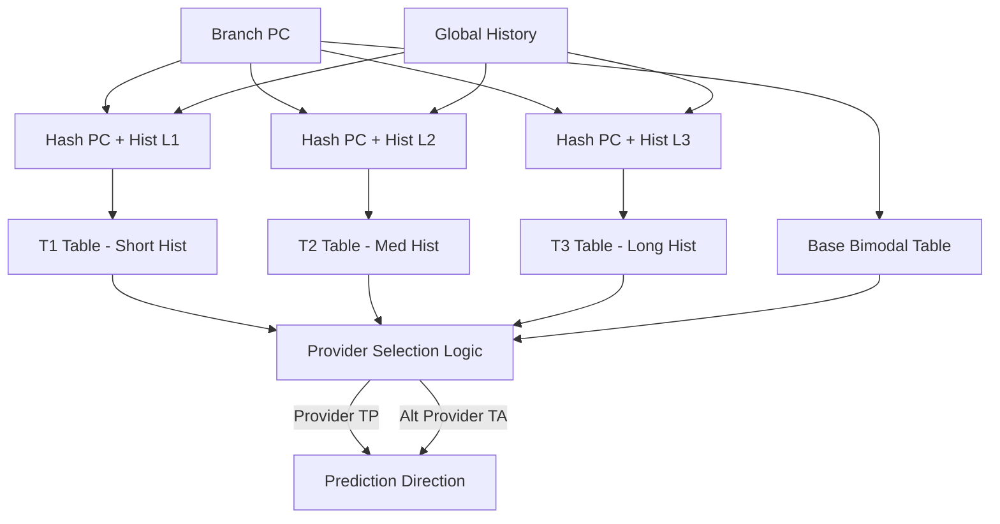

# Implementation Plan: TAGE & ITTAGE Predictors for Zaqal

This document outlines the detailed architectural design and implementation plan for upgrading the branch prediction subsystem of the **Zaqal** processor to support **TAGE** (Tagged Geometric) direction prediction and **ITTAGE** (Indirect Tagged Geometric) target prediction, inspired by the **XiangShan (Kunminghu)** architecture.

---

## 1. Architectural Concepts

### A. TAGE (Tagged Geometric History Length) Predictor
A simple bimodal or gshare predictor cannot capture complex branch patterns that correlate with long execution paths. TAGE addresses this by querying multiple tables in parallel using geometrically increasing lengths of branch history.

1. **Bimodal Base Table ($T_B$)**:
   - PC-indexed table of 2-bit saturating counters.
   - Provides a fallback prediction when no tagged tables match.
2. **Tagged Tables ($T_1, T_2, \dots, T_N$)**:
   - Hashed index using PC and a specific global history segment.
   - Geometric history lengths: $L_i = \text{int}(L_{\min} \times \alpha^{i-1})$.
   - Entries store:
     - `tag`: To verify if the branch matches.
     - `ctr`: 3-bit saturating counter for direction.
     - `u` (usefulness): 1-bit or 2-bit counter tracking if the entry corrected a prediction.
3. **Lookup Phase**:
   - Query all tables in parallel.
   - The matching table with the longest history length is the **Provider ($T_P$)**.
   - The matching table with the second-longest history is the **Alternate Provider ($T_A$)**.
   - If a provider is found, it determines the prediction. (Unless its counter is weak and `use_alt` overrides it).
   - If no tagged table matches, fall back to $T_B$.
4. **Update / Allocation Phase**:
   - **On correct prediction**: Update Provider's counter. If Provider's prediction differs from Alt Provider's, increment Provider's `u` value.
   - **On misprediction (taken/not-taken mismatch)**:
     - Update Provider's counter (closer to actual direction).
     - Try to allocate an entry in a table with a history length longer than the Provider ($T_K$ for $K > P$).
     - Find an entry with $u = 0$. If found, initialize it with a weak counter matching the actual direction, store the tag, and set $u = 0$.
     - If all candidate tables have $u > 0$, decrement their usefulness bits (decay) instead of allocating.



### B. ITTAGE (Indirect Tagged Geometric Target Predictor)
Indirect branches (`jalr` in RISC-V) can target dynamic, non-offset-based addresses (e.g., function pointers, switch-case blocks, virtual method tables). 
- **ITTAGE** uses the exact same tagged geometric lookup mechanism as TAGE but stores **64-bit target addresses** instead of direction counters.
- If a match is found in ITTAGE, its target overrides the default FTB target for `jalr` instructions.

---

## 2. Implementation Steps

### Step 1: Global History Register (GHR) & Checkpointing
We need a speculative GHR in the BPU that shifts in branch directions at the fetch stage and rolls back to a verified snapshot on a redirect/misprediction.
- Implement a `ghr` register in `BPU.scala` (e.g., 64 or 128 bits).
- Support speculative history updates at lookup.
- Include a checkpointing mechanism where the GHR state is saved in the FTQ (using `FetchRequest` / `FetchPacket` metadata) and restored on a redirect signal.

### Step 2: Implement TAGE Predictor Modules (`Tage.scala`)
We will create a module with:
- **TageBTable**: The bimodal table containing 2-bit counters.
- **TageTable**: The tagged tables containing `valid`, `tag`, `ctr`, and `u`.
- **Folded History Generator**: A helper class to fold long histories into shorter indexes using bitwise XOR hashes:
  ```scala
  def foldHistory(ghr: UInt, tableHistLen: Int, indexWidth: Int): UInt
  ```
- **TagePredictor**: The composer module that queries tables and selects the Provider and Alternate Provider.

### Step 3: Implement ITTAGE Predictor Modules (`ITTAGE.scala`)
- Implement `ITTageTable`, which replaces the 3-bit direction counters with 64-bit target addresses.
- Integrate it into the lookup path to output dynamic targets for indirect jumps (`br_type === 2.U`).

### Step 4: Integrate into BPU and Frontend
Modify `BPU.scala`:
- Instantiate `Tage` and `ITTage`.
- Connect lookup ports to the current `s0_pc` and GHR.
- If the instruction is a conditional branch, override the FTB's direction with the TAGE prediction.
- If the instruction is an indirect branch, override the FTB's target address with the ITTAGE target.
- Connect the update interface from `io.redirect` to update the tables.

---

## 3. Stress-Test Program (`ICache.scala`)

To test the geometric predictor, we require a program with a complex branch pattern that a simple bimodal predictor will struggle to predict, but a geometric history predictor will learn.

### Proposed Test Program Sequence
We will add a new case to `ICache.scala`:
```scala
Seq(
  // 1. Initialize loop indices
  "h00a00093".U, // 0x00: addi x1, x0, 10    (Outer loop counter x1 = 10)
  "h00000293".U, // 0x04: addi x5, x0, 0     (Alternating index counter x5 = 0)
  
  // 2. Loop Start
  "h00528293".U, // 0x08: addi x5, x5, 5     (Modify counter)
  "h00128293".U, // 0x0c: addi x5, x5, 1
  
  // 3. Alternating Conditional Branch (Pattern: Taken, Taken, Not-Taken)
  "h0052f713".U, // 0x10: andi x14, x5, 3     (x14 = x5 % 4)
  "h00070463".U, // 0x14: beq x14, x0, 8      (Taken if x14 == 0)
  "h00100793".U, // 0x18: addi x15, x0, 1
  
  // 4. Indirect Branch Stress-Test (Dynamic jump depending on alternating state)
  "h00170813".U, // 0x1c: addi x16, x14, 1
  "h00281893".U, // 0x20: slli x17, x16, 2    (Multiply offset by 4)
  "h0280026f".U, // 0x24: jal x4, 40          (Compute base target of indirect jump blocks)
  // Target 1 for Indirect Jump
  "h00a00793".U, // 0x28: addi x15, x0, 10
  "h00c0006f".U, // 0x2c: jal x0, 12          (Jump to Loop End)
  // Target 2 for Indirect Jump
  "h01400793".U, // 0x30: addi x15, x0, 20
  "h0040006f".U, // 0x34: jal x0, 4           (Jump to Loop End)
  
  // Helper block to calculate dynamic address
  "h01120233".U, // 0x38: add x4, x4, x17     (Add offset to pc-relative base)
  "h000200e7".U, // 0x3c: jalr x1, x4, 0      (Dynamic Jump - ITTAGE target)
  
  // Loop End
  "hfff08093".U, // 0x40: addi x1, x1, -1     (Decrement outer loop)
  "hfc009ae3".U, // 0x44: bne x1, x0, -40     (If x1 != 0, branch to Loop Start)
  "h06300613".U  // 0x48: addi x12, x0, 99    (Done marker: x12 = 99)
)
```
*Rationale*:
- The conditional branch at `0x14` alternates targets based on a mod-4 pattern, which requires tracking history of depth 2 to predict accurately.
- The indirect branch at `0x3c` executes with a dynamic target computed based on `x14` (which itself is history-dependent). A standard BTB will mispredict this target continuously as it switches between `0x28` and `0x30`. The ITTAGE predictor will resolve this by tracking the path history leading to the `jalr`.

---

## 4. GTKWave Verification Guide

To verify the correct operation of TAGE and ITTAGE in GTKWave:

### A. Key Signals to Monitor
Locate these signals under the `Core -> Frontend -> BPU` module instance:

| Signal Name | Purpose | Expected Behavior |
|-------------|---------|-------------------|
| `bpu.ghr` | Global History Register | Shifts in resolved branch direction bits (0 for not-taken, 1 for taken) |
| `bpu.tage.s1_provideds` | TAGE Hit Indicator | High when a tagged table matches the current branch lookup |
| `bpu.tage.s1_providers` | Table Index Provider | Indicates which tagged table (e.g. $T_1$ to $T_4$) provided the prediction |
| `bpu.tage.s1_providerResps.ctr` | TAGE Confidence Counter | 3-bit saturating counter value for the matching entry |
| `bpu.ittage.s1_provideds` | ITTAGE Hit Indicator | High when the dynamic target prediction matches the indirect jump |
| `bpu.ittage.predicted_target` | ITTAGE Target Output | Stores the 64-bit target address for `jalr` instructions |
| `bpu.io_redirect_valid` | Misprediction Redirect | Pulled high by the backend BRU when a misprediction occurs |

### B. Verification Flow
1. **Initial Phase (Warm-up)**:
   - Identify the first few loop iterations. You should see `bpu.tage.s1_provideds` is `0`, and the predictor falls back to `T_B` (Bimodal table).
   - In case of a misprediction, `bpu.io_redirect_valid` will pulse, and you will see an allocation write enable signal for a longer history table.
2. **Intermediate Phase (Training)**:
   - Observe `bpu.ghr` updating with history.
   - For the conditional branch at `0x14`, check how `bpu.tage.s1_provideds` transitions to `1` as entries are allocated and trained in the tagged tables.
   - Observe `bpu.tage.s1_providers` shifting to higher table numbers (longer history) as the mod-4 alternating pattern becomes predicted.
3. **Indirect Branch Target Tracking**:
   - For `0x3c` (`jalr`), trace `bpu.ittage.predicted_target`.
   - In early iterations, target mismatch redirects occur.
   - Once trained, ITTAGE will predict the target dynamically based on the GHR, switching correctly between `0x28` and `0x30` without triggering redirects.
