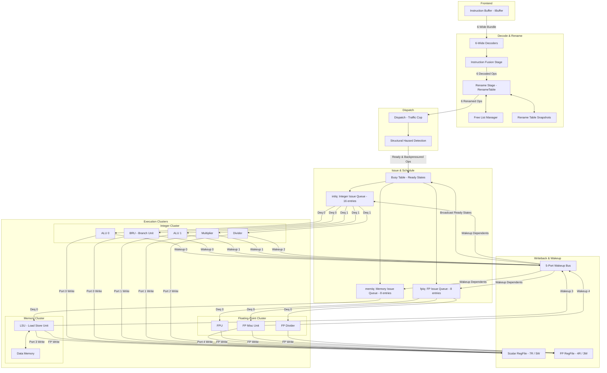

# Zaqal Clustered Backend Architecture

This document maps out the current architecture of the Zaqal processor's backend. It traces the flow of instructions from the Instruction Buffer (IBuffer) through decoding, renaming, dispatching, queueing, and execution, up to writeback and registers wakeup.

---

## 1. Architectural Diagram

---

## 2. Walkthrough of Stage Interactions

1.  **Decode & Fusion**: Up to 6 instructions are dequeued from the `IBuffer` per cycle and decoded. Adjacent operations eligible for macro-op fusion (such as `LUI` + `ADDI`) are merged.
2.  **Rename**: Scalar and Floating-Point logical registers are mapped to physical registers using a `RenameTableWrapper` (which manages the integer RAT, FP RAT, and checkpoint snapshots for branches).
3.  **Dispatch**: The `Dispatch` module classifies instructions by execution type (ALU, MEM, BRU, FPU). It evaluates structural hazards against limits and applies in-order backpressure (stalling the frontend if downstream queues or ports are saturated).
4.  **Issue Queues**: Ready instructions wait in issue queues (`intIq`, `memIq`, `fpIq`). They monitor the `WakeupBus` to clear operand dependencies.
5.  **Execution Units**: Once operands are ready, instructions are issued to specialized execution pipelines. Long-latency operations (like the `Divider`) lock their target units and write back to the register files upon completion.
6.  **Wakeup Broadcast**: Completed instructions broadcast their destination physical registers on the 5-port `WakeupBus` to update the `BusyTable` and wake up dependent instructions waiting in the issue queues.
