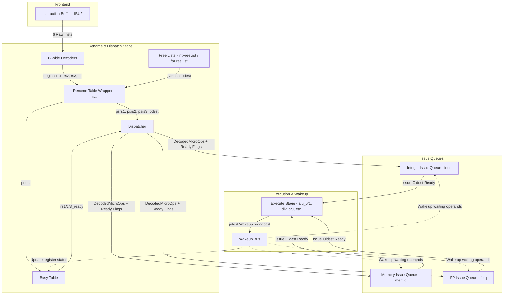

# Zaqal Backend Architecture: Dispatch to Issue Queues

This document explains the architectural concepts, data flow, and control logic between the **Rename/Dispatch stage** and the **Issue Queues** in the Zaqal superscalar processor.

---

## 1. Architectural Data Flow Overview

The Zaqal backend uses an out-of-order execution engine based on the **Register Renaming (Map Table)** and **Distributed Issue Queues** style (similar to the XiangShan Kunminghu core). Below is a block diagram illustrating the flow of instruction packets and register tags through the backend pipeline:

---

## 2. Step-by-Step Data Path Explanation

### Step 1: Decode & Logical Port Extraction (`Decoder.scala`)
The Instruction Buffer (`IBUF`) sends up to 6 instructions (depending on RVC compression and dispatch stalls) to 6 parallel decoders.
* **Fields Extracted**: The decoder parses instruction fields to extract:
  * `rs1`, `rs2`, `rs3` (source registers)
  * `rd` (destination register)
  * Control flags indicating execution units needed: `is_alu`, `is_mem`, `is_bru`, `is_fpu`, and if floating-point registers are used (`rs1_is_fp`, `rd_is_fp`, etc.).
* **Immediate Overlaps**: For immediate instructions (like `addi`), the decoder still extracts the logical source registers. In RISC-V, the lower 5 bits of the 12-bit immediate field overlap with the `rs2` field. This means `addi` instructions will extract a dummy logical `rs2` register (e.g., `addi x2, x0, 10` extracts `rs2 = 10`), which is renamed and looked up in the busy table. This dummy lookup is harmless because the execution units ignore the register operand in favor of the immediate value.

### Step 2: Register Renaming & Bypassing (`RenameTable.scala` & `RenameTableWrapper.scala`)
Since the core is superscalar (6-wide), it must rename up to 6 instructions simultaneously.
1. **Speculative Map Table Lookup**: Logical registers are renamed to physical register tags (from `0` to `95` in the Zaqal configuration) using `intRat` (integer) and `fpRat` (floating-point).
2. **Intra-Bundle Dependency Bypassing**:
   If an earlier instruction in the same 6-wide bundle writes to a register that a later instruction reads (e.g., `addi x1, x0, 1` followed by `addi x2, x1, 2`), the later instruction must read the new speculative physical register assigned to the earlier instruction, not the stale one from the start of the cycle.
   * This is implemented in `RenameTable.scala` using a cascading wire matrix `curr_spec_table` of size `decodeWidth + 1` (7 entries).
3. **Physical Destination (`pdest`) Allocation**:
   For each instruction in the bundle that writes to a register (`rf_wen` or `fp_wen` is active), a new physical register tag is allocated from the `FreeList` (`intFreeList` / `fpFreeList`).

### Step 3: Busy Table & Operand Readiness (`BusyTable.scala`)
To determine if source operands are ready for execution, the physical register tags (`psrs1`, `psrs2`, `psrs3`) are checked against the `BusyTable`.
* **Busy Status Allocation**: When a new `pdest` is allocated, it is marked as **busy** (`ready_table(pdest) := false.B`) using `allocPorts`.
* **Readiness Lookup & Bypassing**: The `BusyTable` returns the readiness status of the source physical registers. If a source tag is `0.U` (meaning `x0`), it is always ready.

### Step 4: Dispatcher Routing & backpressure (`Dispatch.scala`)
The `Dispatch` module receives the renamed instructions and routes them to their corresponding distributed issue queues.
* **Resource Hazards**: The dispatcher tracks cumulative resource requests per slot. If the number of instructions requesting a specific queue type exceeds the available ports, a structural hazard is flagged.
* **Cascaded Stalls**: If instruction `i` cannot be accepted (e.g., if its target issue queue is full or there is a structural hazard), then instruction `i` and all younger instructions in the bundle (slots `i` to `5`) are stalled, backpressuring the instruction buffer.

### Step 5: Inside the Issue Queues (`IssueQueue.scala` & `AgeDetector.scala`)
Each issue queue is a reservation station storage pool (e.g., 16 entries for `intIq`, 8 entries for `memIq`/`fpIq`).
1. **Enqueue and Allocation**: Incoming instructions are written into the first empty entries of the queue.
2. **Dependency & Wakeup**:
   * An entry is ready to issue (`can_issue := true.B`) if it is valid and all three of its operand readiness flags are true.
   * When execution units finish processing, they broadcast the completed `pdest` on the **Wakeup Bus** (`io.wakeup`).
   * The issue queue compares the wakeup tags against all stored physical source registers to mark them ready.
3. **Select / Arbitration (Age-Based Priority)**:
   * The `AgeDetector` maintains an age matrix `age(row)(col)`.
   * It computes the oldest ready instruction(s) to issue to the execution units.
