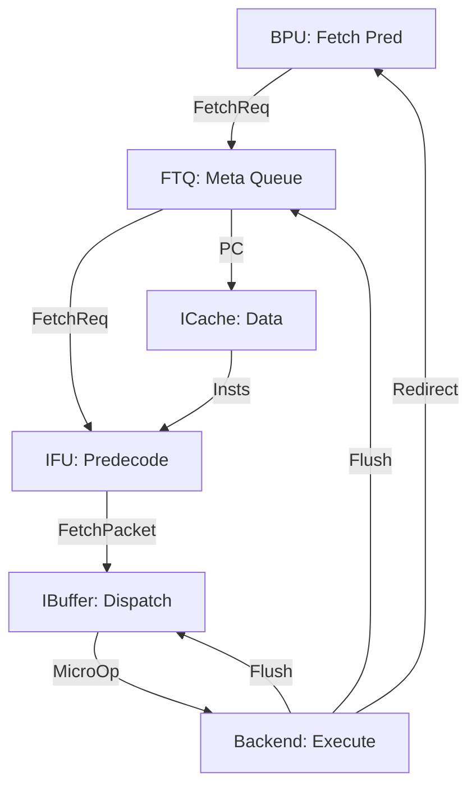

# Zaqal Frontend Architecture

This document describes the design and coordination of the Zaqal processor's Frontend modules.

## Block Diagram

## Modules

### 1. Branch Prediction Unit (BPU)
The BPU is the source of all Fetch Requests. It provides:
- **Next PC**: The start of the next 32-byte fetch block.
- **Prediction Meta**: Target PC, Taken/Not-Taken bit, and the slot (0-7) of the branch.
- **Fetch Mask**: An 8-bit mask used to skip instructions (e.g. for intra-block branches).

### 2. Fetch Target Queue (FTQ)
A circular queue that stores metadata for every fetch packet in flight.
- **Flush Mechanism**: On a misprediction, the `enqPtr`, `deqPtr`, and `count` are reset to 0. The RAM content is NOT cleared to save hardware area.
- **Logical Emptiness**: `valid` signals are dropped based on the `count` register.

### 3. Instruction Fetch Unit (IFU)
A combinational/pipelined stage that combines ICache data with BPU metadata. It runs 8 parallel predecoders to identify branch types and offsets early.

### 4. Instruction Buffer (IBUF)
Acts as a reservoir between the 8-wide Fetch and the 1-wide Backend.
- **Busy Bit**: When `flush` is high, `busy` is set to `false`, immediately killing any pending dispatches.

## Redirection (Flush) Logic

Zaqal uses a **Combinational Redirect** to minimize misprediction penalty (currently 0-1 cycles).

1. **Detection**: `Execute` finds a PC mismatch.
2. **Signal**: `io.redirect.valid` goes HIGH.
3. **Frontend Reset**:
    - **BPU**: Starts fetching from the new correct target.
    - **FTQ**: Resets pointers.
    - **IBUF**: Drops `busy` and clears the current packet.
